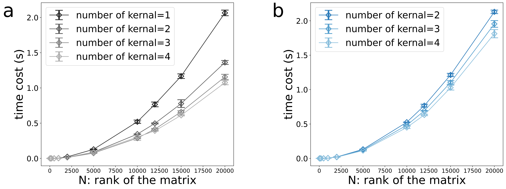

# Advanced-Computational-physics

This is the C++ code for the course work, including MPI parallel programming and Monte Carlo Sampling. 

## MPI parallel programming

Goals: Parallel message passing Library (MPI) is used to accomplish the parallelization task. To be specific, the parallel matrix multiplication vector operation is performed in master-slave mode and peer-to-peer mode, and the calculation time changes with the order of the matrix, and the influence of different kernel number on the calculation time is tested.

Results: Impact of multi-kernel running on computation time. (a) Peer mode. (b) Master-slave mode,

## Monte Carlo Sampling

Goals: Simulate the $J-J$ antiferromagnetic Ising model of one dimensional periodic boundary conditions by Monte Carlo method. Compute the changes of energy $E/N$ magnetization $M/N$, specific heat average magnetization $C_v$ and entropy $S$ with temperature and $J$. Hamiltonian,
$$
\begin{equation}
H=J_1 \sum_{\langle i j\rangle} S_i^z S_j^z+J_2 \sum_{\langle \langle i j\rangle\rangle} S_i^z S_j^z, J_1>0, J_2>0, S^z=\pm \frac{1}{2}
\end{equation}
$$

Results: A phase diagrams of $T$ and $J$ ratio,

